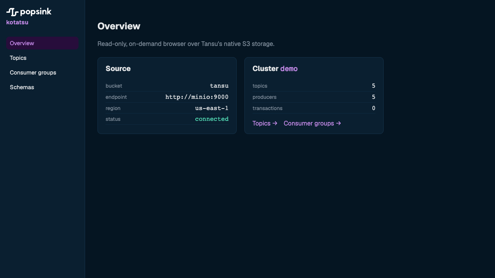
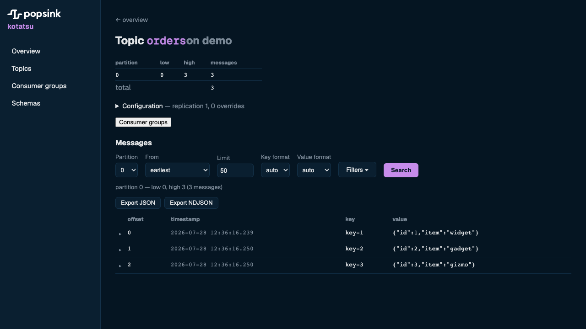

# kotatsu

Read-only, on-demand browser over [Tansu](https://github.com/Popsink/tansu)'s
**native S3 storage**. Topics, events, consumer groups and simple stats are read
directly from the object store Tansu writes to — **no Kafka broker, no Kafka
client, no background polling**. Every read is triggered by a user action.

Built with **Rust (Axum)** + **Nuxt 3**. Release history is in
[`CHANGELOG.md`](CHANGELOG.md).



## What it does

Four constraints shape every feature below:

- **Read-only.** Kotatsu never writes to the bucket or the registry — no produce,
  no offset commit, no schema registration, no topic admin.
- **No broker.** Objects are read from the store directly (S3-compatible, or GCS);
  there is no Kafka client in the dependency tree.
- **No background work.** Nothing polls and nothing warms in the background; a
  request happens because a user asked for it. The list and search views are
  served from a **45 s in-process catalog cache** (`backend/src/storage/catalog.rs`)
  filled lazily by those same requests, so a new topic can take that long to
  appear in a listing. Detail reads are uncached and exact.
- **Bounded scans.** A filtered read has a scan budget and stops at it, so no
  query can turn into an unbounded walk of the store.

What that buys you today:

| Area | What is there |
| --- | --- |
| **Topics** | Hierarchical `org.env.conn` navigation over dotted topic names, searchable at each level. Per-topic partitions, watermarks, message counts, configuration overrides and **on-disk size** attributed from the segment footers. |
| **Events** | Event browser per topic: one partition or all merged, seek from `earliest` / `latest` / a concrete offset / a timestamp, key & value rendered as `auto` / `avro` / `json` / `raw`, and `Load more` that resumes from the previous window's cursor rather than re-reading it. |
| **Filters** | Substring or **regex** filters on key, value, header key and header value, applied to the *decoded* fields, forward-scanning within the budget. |
| **Export** | The fetched window as **JSON** or **NDJSON**. |
| **Schemas** | Avro payloads resolved against [Kora](https://github.com/Popsink/kora) (Confluent-compatible registry) and decoded in place; a browser over subjects, their versions and compatibility level. |
| **Consumer groups** | Group list, per-group detail with members and committed offsets, per-partition lag, and the groups consuming a given topic. |
| **Honest numbers** | Watermarks respect what the log actually still serves: a rederived low watermark, `DeleteRecords` truncation floors, and offset ranges certified dead by segment expiry are excluded from counts rather than shown as messages that never load. |



## Architecture

Tansu persists everything to S3 under a known layout (`tansu-storage::dynostore`,
documented in `Popsink/tansu:docs/virtual-topics-format.md`):

```
clusters/{cluster}/meta.json                                        producer/txn metadata
clusters/{cluster}/topic-metadata/{topic}.json                      per-topic spec + configs
clusters/{cluster}/topic-routing/{topic}.json                       the prefix a topic is routed under + its sub-stream id
clusters/{cluster}/topics/{topic}/partitions/{p:010}/watermark.json high, truncation floor, served end
clusters/{cluster}/prefixes/{prefix}/segments/{seq:020}.seg         the records themselves
clusters/{cluster}/groups/consumers/{group}.json                    consumer group detail
clusters/{cluster}/groups/consumers/{group}/offsets/{topic}/partitions/{p:010}.json
```

Records live in **shared per-prefix segment objects**, each multiplexing many
sub-streams: a footer at the tail of the segment says where each sub-stream's bytes
and offsets are, so reading one topition is a ranged GET of exactly its own byte
span. Which prefix a topic is routed under, and **what identifies its sub-stream**
inside those segments, are both **pinned at creation** and not derivable from its
name: a compacted topic is routed under its own full name, and a topic created
since footer v4 is keyed by a `substream_id` rather than by its name, so a topic
recreated under a dead topic's name cannot read the slices that outlived it (#118).
The per-partition `records/{offset}.batch` layout this replaced is gone from the
broker and from Kotatsu (#93).

Kotatsu reads these objects via the `object_store` crate and decodes the record
batches with `tansu-sans-io`, pinned to the same fork revision the broker writes
with. That pin is a **two-sided contract**: the `tansu-sans-io` tag in
`backend/Cargo.toml` and `TANSU_VERSION` in `docker-compose.yml` must name the
same version. The `tansu-pin` workflow enforces it in two severities — a change
that lets the two pins disagree **fails**, while both lagging the fork's latest
tag is only a weekly **notice**, since someone else's release cadence should not
block a merge (#97).

Avro values are resolved against [Kora](https://github.com/Popsink/kora)
(Confluent-compatible schema registry). See the GitHub issues for the full design.

## Project layout

```
kotatsu/
├── backend/          # Rust (Axum) — object_store + tansu-sans-io, no Kafka client
├── frontend/         # Nuxt 3 (SPA), served as static assets by the backend in prod
├── bindings/python/  # async Python bindings over the same read core (PyO3 + maturin)
├── chart/kotatsu/    # Helm chart, published as an OCI artifact
├── e2e/              # ISTQB test cases per module + the Playwright CI smoke + seed.sh
├── loadtest/         # k6 harness for the read path
├── .github/          # CI, image + chart release, and the Tansu version-pin check
├── Dockerfile        # multi-stage → single image (backend serves frontend)
└── docker-compose.yml
```

`backend/src/storage/` and `backend/src/query.rs` are the read core: the HTTP API
and the Python bindings are two thin front-ends over the same functions, so they
answer identically.

## Run locally (development)

Two processes, with the frontend proxying `/api` to the backend.

```bash
# 1. backend
cd backend
cargo run            # listens on 0.0.0.0:8080

# 2. frontend (separate terminal)
cd frontend
npm install
npm run dev          # http://localhost:3000, proxies /api → http://localhost:8080
```

Environment variables (backend):

| Var                  | Default          | Purpose                                     |
| -------------------- | ---------------- | ------------------------------------------- |
| `KOTATSU_BIND`       | `0.0.0.0:8080`   | HTTP bind address                           |
| `KOTATSU_STATIC_DIR` | _(unset)_        | Dir of built frontend assets (prod only)    |
| `KOTATSU_KORA_URL`   | _(unset)_        | Kora base URL; unset disables Avro decoding |

The S3 source is configured with `KOTATSU_S3_*` / `KOTATSU_CLUSTER` — see
[Pointing at an S3 source](#pointing-at-an-s3-source).

## Run with Docker

```bash
docker compose up --build
```

Starts the Kotatsu app (backend + bundled frontend) on http://localhost:8080 and
a MinIO S3 on http://localhost:9000 (console at :9001, `minioadmin`/`minioadmin`)
with a `tansu` bucket created automatically.

It also starts a **Tansu broker** (`localhost:9092`, cluster `demo`) writing to
that bucket, so you can generate real events. That broker is the **Popsink fork**
(`ghcr.io/popsink/tansu`) at the pinned `TANSU_VERSION`, because upstream writes a
different storage layout from the one Kotatsu reads in production — see the pin
contract under [Architecture](#architecture).

```bash
# create a topic + produce a few messages with any Kafka client
docker run --rm --network kotatsu_default apache/kafka:latest \
  /opt/kafka/bin/kafka-topics.sh --bootstrap-server tansu:9092 \
  --create --topic orders --partitions 1 --replication-factor 1

printf 'key-1:{"id":1}\n' | docker run -i --rm --network kotatsu_default apache/kafka:latest \
  /opt/kafka/bin/kafka-console-producer.sh --bootstrap-server tansu:9092 \
  --topic orders --property parse.key=true --property key.separator=:
```

The records land under `clusters/demo/topics/orders/…` in the bucket and are
read back by Kotatsu. For a ready-made set of fictitious topics (including a
compacted one and one with a truncation floor), use the e2e seed instead:

```bash
NETWORK=kotatsu_default ./e2e/scripts/seed.sh
```

The stack also runs **Kora** (Confluent-compatible schema registry) on
`localhost:8085` with its own PostgreSQL; the app resolves Avro schemas via
`KOTATSU_KORA_URL=http://kora:8080`. To produce Confluent-framed **Avro** events
(schema auto-registered in Kora):

```bash
printf '{"id":1,"item":"widget"}\n' | docker run -i --rm --network kotatsu_default \
  confluentinc/cp-schema-registry:7.6.0 kafka-avro-console-producer \
  --bootstrap-server tansu:9092 --topic avro-orders \
  --property schema.registry.url=http://kora:8080 \
  --property value.schema='{"type":"record","name":"Order","fields":[{"name":"id","type":"int"},{"name":"item","type":"string"}]}'
```

Kotatsu decodes these in the event browser and lists the schema under **Schemas**.

To build the single production image on its own:

```bash
docker build -t kotatsu .
docker run -p 8080:8080 kotatsu
```

Pushed images are published to **`ghcr.io/popsink/kotatsu`** by the `release`
workflow on every push to `main` (tagged `main` + `sha`) and on `v*` tags
(semver + `latest`), built for `linux/amd64` and `linux/arm64`.

```bash
docker run -p 8080:8080 ghcr.io/popsink/kotatsu:latest
```

## Kubernetes (Helm)

A Helm chart is published as an OCI artifact to
**`oci://ghcr.io/popsink/charts/kotatsu`** by the `chart-release`
workflow.

```bash
helm install kotatsu oci://ghcr.io/popsink/charts/kotatsu --version 0.1.1 \
  --set s3.bucket=tansu \
  --set s3.cluster=demo \
  --set koraUrl=http://kora:8080
```

`s3.cluster` and `s3.bucket` are required. Provide static keys via
`s3.accessKey`/`s3.secretKey`, or omit them to use the pod's IAM role — attach
it through `serviceAccount.annotations` (EKS IRSA) or a Pod Identity
association. See [`chart/kotatsu/values.yaml`](chart/kotatsu/values.yaml) for all
options.

## HTTP API

Everything the UI does, it does through this API, and so do the load tests. (The
Python bindings skip it — they call the same read core in-process.) All routes
are `GET`, all are read-only, all return JSON.

| Route | Purpose | Query params |
| --- | --- | --- |
| `/health`, `/api/health` | liveness, no I/O | — |
| `/api/source` | configured source: bucket, cluster, endpoint, region. No I/O | — |
| `/api/source/status` | live connectivity probe against the store | — |
| `/api/clusters` | cluster ids found under `clusters/` | — |
| `/api/clusters/{cluster}` | `meta.json` summary: topic, producer and transaction counts | — |
| `/api/clusters/{cluster}/topic-tree` | one level of the dotted-name tree; `level` says whether the rows are group nodes or topics | `prefix`, `search`, `limit`, `offset` |
| `/api/clusters/{cluster}/topics` | flat topic list, matched against the **full** dotted name | `search`, `limit`, `offset` |
| `/api/clusters/{cluster}/topics/{topic}` | partitions, watermarks, counts, configs, size | — |
| `/api/clusters/{cluster}/topics/{topic}/groups` | groups with a committed offset on this topic | — |
| `/api/clusters/{cluster}/topics/{topic}/messages` | the event browser's read | see below |
| `/api/clusters/{cluster}/groups` | consumer group list | `search`, `limit`, `offset` |
| `/api/clusters/{cluster}/groups/{group}` | members, committed offsets, per-partition lag | — |
| `/api/schemas` | registry subjects (`503` when no registry is configured) | `search`, `limit`, `offset` |
| `/api/schemas/{subject}` | versions, latest schema, compatibility level | — |
| `/api/schemas/{subject}/versions/{version}` | one version's schema | — |

`messages` parameters:

| Param | Default | Meaning |
| --- | --- | --- |
| `partition` | `all` | a partition number, or `all` to merge every partition |
| `offset` | `latest` | `earliest`, `latest`, `timestamp:<ms>`, or a concrete offset. Also decides which way the read travels |
| `cursor` | — | resume points from a previous response, `0:412,3:998` (#104) |
| `limit` | `50` | records returned, capped at `MAX_LIMIT` |
| `key_format`, `value_format` | `auto` | `auto` \| `avro` \| `json` \| `raw` |
| `key_contains`, `value_contains`, `header_key`, `header_value` | — | filters over the decoded fields |
| `regex` | `false` | treat the filters as regular expressions |
| `max_scan` | `DEFAULT_MAX_SCAN` | scan budget for a filtered read, capped at `MAX_SCAN_CAP` |

The scan budget is what keeps the on-demand model honest — a filtered read walks
forward until it fills `limit` or spends `max_scan`, and every response carries
`count`, `scanned` and `exhausted` so the caller can tell which of the two
stopped it. The three constants live in
[`backend/src/query.rs`](backend/src/query.rs):

| Constant | Value | Meaning |
| --- | --- | --- |
| `MAX_LIMIT` | 500 | most records one call can return |
| `DEFAULT_MAX_SCAN` | 5 000 | scan budget when the caller does not set one |
| `MAX_SCAN_CAP` | 50 000 | hard ceiling on records scanned per call |

## Python bindings

`bindings/python/` builds the same read core as an async Python module (PyO3 +
maturin), so a service can read Tansu's storage without going through the HTTP
API or a Kafka client:

```python
src = kotatsu.Source(bucket="tansu", cluster="demo", endpoint="http://localhost:9000")
page = await src.messages("orders", offset="earliest", limit=50, value_contains="widget")
print(page["count"], page["scanned"], page["records"])
```

Build, install and the full method list are in
[`bindings/python/README.md`](bindings/python/README.md). CI builds the wheel and
import-smokes it on every PR.

## Testing

Four layers, cheapest first.

**1. Unit tests** — decode, keys, parsing, pagination. No services.

```bash
cd backend
cargo test
cd ../frontend && npm test        # Vitest: utils, composables, components
```

**2. Integration tests** — under `backend/tests/`, **`#[ignore]`-gated** so the
unit job needs no infrastructure; CI runs them in a separate `integration` job
that brings the services up first. Each suite names what it needs:

| Suite | Services | Data |
| --- | --- | --- |
| `groups_integration` | `minio createbucket` | seeds a synthetic group into the bucket and cleans up |
| `schema_integration` | `kora kora-db` | registers its own schema (idempotent) |
| `s3_integration` | `minio createbucket tansu` | reads what a real broker wrote — needs an `orders` topic with a few records produced first |

```bash
docker compose up -d minio createbucket tansu kora kora-db
# produce to `orders` (see "Run with Docker" above) for the s3 suite
cd backend
cargo test -- --ignored          # all three
cargo test --test groups_integration -- --ignored   # or one at a time
```

**3. End-to-end** — [`e2e/`](e2e/README.md). ISTQB-format test cases across seven
modules (source, topics, messages, groups, schemas, navigation, health), driven
semi-manually, plus an automated Playwright smoke that CI runs on every PR
against the full compose stack:

```bash
docker compose up -d --build
NETWORK=kotatsu_default ./e2e/scripts/seed.sh
cd e2e/ci && npm install && npx playwright install chromium
BASE_URL=http://localhost:8080 npx playwright test
```

**4. Load** — [`loadtest/`](loadtest/README.md), a k6 harness over the read path.

```bash
cd loadtest
KOTATSU_URL=http://localhost:8080 KOTATSU_CLUSTER=demo k6 run scenarios/smoke.js
```

## Pointing at an S3 source

Set the bucket/endpoint and the Tansu cluster name (see `docker-compose.yml`
for the variable names). A single source per instance for now; multi-source
comes later.

| Var | Purpose |
| --- | --- |
| `KOTATSU_S3_BUCKET` | bucket holding Tansu's storage |
| `KOTATSU_CLUSTER` | Tansu cluster id (`clusters/{cluster}/` prefix) |
| `KOTATSU_S3_ENDPOINT` | custom endpoint (MinIO/R2); omit for AWS |
| `KOTATSU_S3_REGION` | region (default `us-east-1`) |
| `KOTATSU_S3_FORCE_PATH_STYLE` | `true` for MinIO/most S3s; set `false` for AWS S3 |
| `KOTATSU_S3_ACCESS_KEY` / `_SECRET_KEY` | static keys (optional) |
| `KOTATSU_S3_SESSION_TOKEN` | session token for static temporary creds (optional) |

### Google Cloud Storage

Set `KOTATSU_STORAGE_PROVIDER=gcs` and the store is a GCS bucket instead
(`KOTATSU_S3_BUCKET` still names it; the other `KOTATSU_S3_*` variables do not
apply). Credentials come from `object_store`'s own environment —
`GOOGLE_SERVICE_ACCOUNT` (JSON key content), `GOOGLE_SERVICE_ACCOUNT_PATH` or
`GOOGLE_APPLICATION_CREDENTIALS` — or from Workload Identity on GKE.

### Credentials: static keys or an IAM role

If `KOTATSU_S3_ACCESS_KEY`/`KOTATSU_S3_SECRET_KEY` are set they are used
directly. **Otherwise Kotatsu resolves credentials from the ambient AWS chain**,
so it can run with no secrets:

1. environment — `AWS_ACCESS_KEY_ID` / `AWS_SECRET_ACCESS_KEY` / `AWS_SESSION_TOKEN`
2. **web identity (EKS IRSA)** — `AWS_WEB_IDENTITY_TOKEN_FILE` + `AWS_ROLE_ARN`
3. **EKS Pod Identity / ECS** — container credential endpoints
4. **EC2/ECS instance role** — IMDS

Temporary credentials are refreshed automatically. On EKS, attach a role to the
pod's ServiceAccount (IRSA annotation `eks.amazonaws.com/role-arn`) or via an
EKS Pod Identity association — the platform injects the env above and Kotatsu
picks it up. For real AWS S3 also set `KOTATSU_S3_FORCE_PATH_STYLE=false` and
leave `KOTATSU_S3_ENDPOINT` unset.
